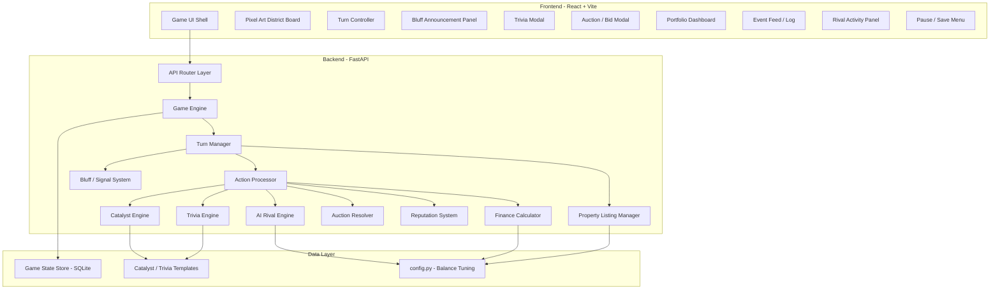

# Mogul Blocks — Architecture Document

## Overview

Mogul Blocks is a single-player real estate tycoon web game where pop culture knowledge drives investment decisions and finance concepts are taught through gameplay mechanics. This document defines the technical architecture for building the game with a **Python FastAPI backend** and a **React (Vite) frontend** with a **pixel art visual style**.

---

## Architecture Pattern: Client–Server with REST API + WebSocket

```
┌──────────────────────────────────┐         ┌───────────────────────────────────────┐
│           FRONTEND               │         │              BACKEND                  │
│    React + Vite + TypeScript     │  HTTP   │           FastAPI (Python)            │
│      Pixel Art + Animations      │◄───────►│                                       │
│                                  │  REST   │  • Game Engine                        │
│  • Game Board (pixel tiles)      │   +     │  • AI Rival Logic                     │
│  • Turn Controls                 │   WS    │  • Catalyst / Trivia Engine           │
│  • Trivia Modal                  │         │  • Finance System                     │
│  • Portfolio Dashboard           │         │  • Auction Resolver                   │
│  • Sprite Animations             │         │  • Bluff / Signal System              │
└──────────────────────────────────┘         └───────────────────────────────────────┘
                                                        │
                                                        ▼
                                              ┌───────────────────┐
                                              │     Data Layer     │
                                              │  SQLite (MVP) for  │
                                              │  save/resume       │
                                              └───────────────────┘
```

### Why This Pattern?

| Decision | Rationale |
|---|---|
| **Client–Server over pure client-side** | Python backend enables AI logic in Python, server-authoritative game state prevents cheating, cleanly separates concerns for future multiplayer |
| **FastAPI** | Async-capable, auto-generates OpenAPI docs, fast for prototyping, Python-native |
| **React + Vite + TypeScript** | Component architecture maps to game panels. Vite provides instant HMR. TypeScript catches state bugs early |
| **Pixel Art** | On-brand for Pixel Park theme, retro aesthetic appeals to 18–28 demographic, sprite sheets enable animated property upgrades |
| **REST + WebSocket hybrid** | REST for player actions. WebSocket for real-time push events (catalyst reveals, AI moves, auction countdowns) |
| **SQLite** | Zero-config, file-based, handles save/resume for single-player. Swap to PostgreSQL in Phase 3 (multiplayer) |

---

## High-Level Component Map



---

## Essential Components — Deep Dive

### 1. Game Engine (`game_engine/engine.py`)

The central orchestrator. Owns the master game state and coordinates all subsystems.

**Responsibilities:**
- Initialize a new game (generate properties, schedule catalyst events, spawn AI rivals)
- Process a full turn cycle: bluff phase → player actions → AI actions → event resolution → rent collection → state update
- Enforce rules (AP limits, cash constraints, ownership validation)
- Determine game-over conditions: **fixed 20 turns** OR **net worth target ($500K) reached after turn 10 with ≥3 properties**
- Check bankruptcy conditions each turn
- Calculate final scores and winner

**Dual win condition logic:**
- The game always runs a minimum of 10 turns
- After turn 10, if a player's net worth ≥ $500,000 **AND** they own ≥ 3 properties → early victory ("Mogul Victory")
- If no early victory, the game ends at turn 20 with a standard score comparison
- The ≥3 property requirement prevents cheese strategies and teaches portfolio diversification

**Math proof — why ≥3 properties is the right safeguard:**

> A player attempting to cheese the $500K target with only 2 premium properties ($75K each):
> - Total purchase cost: $150K (2× starting cash of $75K — impossible without mortgage)
> - Full development cost (3 levels each): 6 × ($1,500 + 15% × $75K) = $76,500
> - Total investment needed: $226,500
> - Since mortgage unlocks at turn 10, the player can only buy 1 property turns 1–9
> - 1 fully-developed $75K property with +50% catalyst = ~$143K portfolio value
> - Even with mortgage leverage at turn 10, net worth peaks at ~$466K by turn 13
> - **Result: mathematically impossible to hit $500K with only 2 properties before turn 15+**
> - The ≥3 property requirement costs nothing to implement and provides safety margin

**Key state object:**

```python
@dataclass
class GameState:
    turn: int                          # Current turn (1–20)
    player: PlayerState                # Cash, properties, reputation, unlocks, debt
    rivals: list[RivalState]           # AI rival states
    districts: dict[str, District]     # District data with rent multipliers
    properties: list[Property]         # All properties (listed + unlisted)
    listed_property_ids: list[str]     # Currently available for purchase
    event_queue: list[CatalystEvent]   # Hidden upcoming events
    revealed_intel: list[IntelItem]    # What the player has uncovered
    history: list[TurnRecord]          # Full turn-by-turn log
    finance_tier: int                  # Current finance unlock level (1–4)
    milestones: MilestoneTracker       # Track unlock conditions
    announcements: list[Announcement]  # Bluff/signal history
    is_paused: bool                    # Pause state for save/resume
```

---

### 2. Turn Manager (`game_engine/turn_manager.py`)

Handles the turn lifecycle. **Rent is collected at end of turn** — players must spend before they earn, forcing cash flow planning.

**Flow per turn:**

```
Start of Turn
  │
  ├── Resolve scheduled catalyst events (update district multipliers)
  ├── Release new property listings (drip-feed schedule)
  ├── Pay mortgage interest (deducted from cash, if applicable)
  │
  ├── Bluff Phase (optional, free — no AP cost)
  │     └── Player may make one public announcement
  │
  ├── Player Phase (3 AP)
  │     ├── Player submits actions via API
  │     ├── Validate AP budget + cash
  │     └── Execute each action through Action Processor
  │
  ├── AI Phase
  │     ├── AI reads player's announcement (if any) and adjusts strategy
  │     ├── Each rival selects actions based on archetype + difficulty
  │     └── Resolve conflicts (sealed-bid auctions, tenant bidding)
  │
  ├── Resolution Phase
  │     ├── Apply all state changes atomically
  │     ├── *** Collect rent for all property owners ***
  │     ├── Check debt/LTV → bankruptcy warning or forced liquidation
  │     ├── Check milestone conditions → unlock finance tools
  │     ├── Check net worth victory (if turn ≥ 10)
  │     └── Advance turn counter
  │
  └── Push turn summary to client (WebSocket)
```

---

### 3. Property Listing Manager (`game_engine/listings.py`)

Controls property availability via a drip-feed schedule.

**Schedule:**
- **Turn 1:** 3 properties available (1 budget, 1 mid-range, 1 budget)
- **Turn 3:** +1 new listing (mid-range)
- **Turn 5:** +1 new listing (budget)
- **Turn 7:** +1 new listing (mid-range)
- **Turn 9:** +1 new listing (premium)
- **Turn 12:** +1 new listing (mid-range)
- **Turn 15:** +1 new listing (premium)
- **Turn 18:** +1 new listing (budget — last listing)

**Total: 10 properties revealed over 18 turns.**

This creates strategic timing decisions: do you buy what's available now, or save cash anticipating a premium listing later? Players with good intel (from research) can time purchases around both catalysts AND new listings.

---

### 4. Action Processor (`game_engine/actions/`)

One module per action type. Each validates input, computes effects, and returns state mutations.

| Module | Action | AP | Key Logic |
|---|---|---|---|
| `buy.py` | Buy | 1 | Check cash, check listing availability, trigger auction if AI also wants it |
| `develop.py` | Develop | 1 | Check ownership, calculate cost (flat + %), apply upgrade, increase rent yield |
| `research.py` | Research | 1 | Select trivia question, validate answer, reveal or mislead |
| `bid.py` | Bid | 2 | Premium tenant auction, sealed-bid resolution *(Post-MVP)* |
| `trade.py` | Trade | 1 | Propose deal to AI, evaluated by personality + reputation *(Post-MVP)* |
| `sabotage.py` | Sabotage | 2 | Select type, apply effect to rival *(Post-MVP)* |

**Development cost formula:**

```
Cost = FLAT_FEE + (PERCENT_FEE × property_market_value)
Cost = $1,500 + (15% × property_value)
```

| Property Value | Dev Cost | Dev as % of Value |
|---|---|---|
| $12,000 | $3,300 | 27.5% |
| $25,000 | $5,250 | 21.0% |
| $40,000 | $7,500 | 18.8% |
| $60,000 | $10,500 | 17.5% |
| $75,000 | $12,750 | 17.0% |

> **Design note:** The flat fee makes cheap properties relatively more expensive to develop (27.5% vs 17%). This is intentional — premium properties offer better economies of scale, but require more upfront capital. This creates a genuine strategic tradeoff between "many cheap properties" vs "few expensive ones."

---

### 5. Catalyst Engine (`game_engine/catalysts/`)

Generates and manages the hidden event queue.

**At game start:** Generate 3–5 catalyst events from templates, scheduled for future turns.

**Template system:**

```python
# catalyst_templates.json
{
    "templates": [
        {
            "pattern": "{entity} {action} {district}",
            "entities": ["Streaming giant", "Esports league", "Indie studio"],
            "actions": ["opens HQ in", "pulls out of", "hosts tournament in"],
            "effects": {
                "opens HQ in": {"rent_modifier": 1.35, "duration": 3},
                "pulls out of": {"rent_modifier": 0.70, "duration": 2}
            }
        }
    ]
}
```

**When all catalysts are exhausted (Research edge case):**

If a player researches but all catalyst events have already been revealed, the engine uses a **hybrid fallback**:
- **70% chance:** Generate a new catalyst event on the fly and add it to the queue (the market never sleeps — new events always emerge)
- **30% chance:** Reveal **AI rival intel** instead (rival's cash reserves, their next likely move, or their hidden strategy tendencies)

This ensures Research is **always worth spending AP on**, mirroring the real world where diligent research always yields some edge. It also prevents a degenerate strategy of "research spam early, then never research again."

---

### 6. Trivia Engine (`game_engine/trivia/`)

**Question flow:**

```
Player spends 1 AP on Research
  │
  ├── Select a catalyst event from the hidden queue
  ├── Generate a trivia question (difficulty selected by player)
  │
  ├── Correct Answer:
  │     ├── Easy → Reveal affected district
  │     ├── Medium → Reveal district + direction (up/down)
  │     └── Hard → Reveal district + direction + magnitude + timing
  │
  └── Wrong Answer:
        └── Return plausible but INCORRECT intel (wrong district, wrong direction, etc.)
```

**Trivia content source: AI-generated via GPT API**

Trivia questions are generated dynamically by calling OpenAI's GPT API (or compatible LLM). This provides:
- **Unlimited question variety** — no running out of questions across games
- **Thematic relevance** — questions are generated based on the catalyst event they're tied to (e.g., a gaming catalyst generates gaming trivia)
- **Difficulty control** — the prompt specifies Easy/Medium/Hard and the required format

**Implementation:**

```python
async def generate_trivia(catalyst: CatalystEvent, difficulty: str) -> TriviaQuestion:
    prompt = f"""
    Generate a {difficulty} pop culture trivia question related to: {catalyst.theme}
    Category: {catalyst.district_theme} (gaming, esports, tech)
    Format: Return JSON with 'question', 'options' (4 choices), 'correct_answer', 'explanation'
    Difficulty guide:
    - Easy: general knowledge, most people would know
    - Medium: requires some specific knowledge
    - Hard: requires deep/niche knowledge
    """
    response = await openai_client.chat.completions.create(
        model="gpt-4o-mini",  # Cost-effective for trivia
        messages=[{"role": "user", "content": prompt}],
        response_format={"type": "json_object"}
    )
    return parse_trivia_response(response)
```

**Cost analysis (gpt-4o-mini pricing):**
- ~$0.15 per 1M input tokens, ~$0.60 per 1M output tokens
- Each trivia call: ~200 input + ~150 output tokens ≈ $0.00012 per question
- 20-turn game with ~5–8 research actions ≈ $0.001 per game
- **1,000 games = ~$1.00** — negligible cost

**Fallback:** A curated JSON bank of 50 pre-written questions serves as offline fallback if the API is unavailable. These are loaded from `questions_fallback.json`.

**Backend dependency added:** `openai` Python package in `requirements.txt`. API key stored in environment variable `OPENAI_API_KEY`.

---

### 7. AI Rival Engine (`game_engine/ai/`)

**Strategy pattern** — each archetype is a pluggable strategy.

```python
class RivalStrategy(ABC):
    @abstractmethod
    def select_actions(self, state: GameState, own: RivalState) -> list[Action]: ...
    
    @abstractmethod
    def react_to_announcement(self, announcement: Announcement) -> None:
        """Adjust internal priorities based on player's bluff/signal."""

class FlipperStrategy(RivalStrategy):  # MVP
    """Buys cheap, sells at any profit, never develops."""

class BuilderStrategy(RivalStrategy):  # Phase 2
    """Buys and develops aggressively, uses heavy leverage."""

class AnalystStrategy(RivalStrategy):  # Phase 2
    """Research-heavy, fewer but better-timed moves. Tracks announcement reliability."""

class SharkStrategy(RivalStrategy):    # Phase 2
    """Sabotage-heavy. May counter-signal with own fake announcements."""
```

**Difficulty scaling:**
- **Easy:** AI reacts to catalysts 1–2 turns late, ignores player announcements
- **Hard:** AI has a probability of "knowing" events early, actively processes announcements

---

### 8. Bluff System — "Trash Talk" (`game_engine/bluffing.py`)

**How it works:**

At the start of each turn, **before** spending AP, the player may say one thing to their rival (free, no AP cost). This shows up in the **Trash Talk** board and the AI rival reacts to it.

**Announcement types:**

| Announcement | Example | What AI Hears |
|---|---|---|
| Investment intent | "I'm going to invest heavily in Pixel Park" | AI may compete for Pixel Park properties |
| Divestment signal | "I'm planning to sell my properties" | AI may wait for a deal or lower their bids |
| District opinion | "I think the Tech district is overvalued" | AI may avoid that district |
| Rival callout | "I'm coming for your tenant" | Shark/Analyst may defend proactively |

**The bluff mechanic:**

The player can say one thing and do another. Announce "investing in Pixel Park" → rivals pile into Pixel Park → you quietly buy cheap in an uncontested district.

**Signal credibility tracking:**

```python
@dataclass
class SignalHistory:
    total_announcements: int = 0
    truthful_announcements: int = 0
    
    @property
    def credibility(self) -> float:
        if self.total_announcements == 0:
            return 0.5  # Unknown — AI gives benefit of the doubt
        return self.truthful_announcements / self.total_announcements
```

- **High credibility (>0.7):** AI rivals trust your announcements and react strongly. Makes your rare bluffs devastating.
- **Low credibility (<0.3):** AI rivals discount your announcements. Signals become useless, but bluffs also stop working.
- **Sweet spot (~0.5):** AI is uncertain, creating maximum strategic ambiguity.

**MVP behavior (Flipper only):** The Flipper has a simple reaction — if you announce interest in a district with cheap properties, it races to buy there first. Bluffing the Flipper into the wrong district is the first taste of strategic misdirection.

**Phase 2 behavior:**
- **Analyst** tracks your credibility over multiple turns and adjusts trust weight
- **Shark** makes its own announcements (counter-signaling), creating a mind-game layer
- **Builder** mostly ignores announcements (too focused on developing)

---

### 9. Finance Calculator (`game_engine/finance/`)

**Core calculations:**

| Metric | Formula | When Available |
|---|---|---|
| Rent Income | `property_value × BASE_RENT_YIELD × rent_multiplier × dev_multiplier` | Always |
| Net Operating Income | Rent Income − Operating Expenses | Always (unlabeled until Tier 4) |
| Development Cost | `FLAT_FEE + (PERCENT_FEE × property_value)` | Always |
| Mortgage Payment | `outstanding_balance × MORTGAGE_INTEREST_RATE` per turn | Tier 2 (Turn 10+) |
| Loan-to-Value (LTV) | `total_debt / total_portfolio_value` | Internal (drives bankruptcy) |
| Cap Rate | `NOI / property_value` | Tier 4 (label only) |
| ROI | `(gain − cost) / cost` | Tier 4 (label only) |

**Bankruptcy system:**

```python
def check_bankruptcy(player: PlayerState) -> BankruptcyStatus:
    if player.total_debt == 0:
        return BankruptcyStatus.SAFE
    
    ltv = player.total_debt / player.portfolio_value
    
    if ltv >= BANKRUPTCY_LTV:      # 100% — insolvent
        return BankruptcyStatus.BANKRUPT  # Game over
    elif ltv >= DEBT_WARNING_LTV:  # 80% — danger zone
        return BankruptcyStatus.WARNING   # Must sell next turn or face bankruptcy
    else:
        return BankruptcyStatus.SAFE
```

**Bankruptcy flow:**
1. Player borrows against portfolio (max 70% LTV)
2. A downturn catalyst hits → property values drop 20–30%
3. LTV spikes above 80% → **WARNING**: "You are over-leveraged. Sell a property next turn or face bankruptcy."
4. If player doesn't sell (or can't cover the gap) → LTV exceeds 100% → **GAME OVER: Bankruptcy**
5. Player sees: "Your debt exceeded the value of your entire portfolio. This is what over-leverage looks like."

**Milestone tracker:**

```python
@dataclass
class MilestoneTracker:
    auctions_won_profitably: int = 0    # → Comparable Analysis at 3
    downturns_survived: int = 0          # → Stress Testing at 1
    catalysts_predicted: int = 0         # → Trend Modeling at 5
    bluffs_executed: int = 0             # → Market Manipulation at 1
```

---

### 10. Auction Resolver (`game_engine/auctions.py`)

When both player and AI want the same property:

1. Player submits a bid amount via `AuctionModal`
2. AI submits a bid based on strategy + noise
3. Highest bid wins; winner pays their bid
4. Overpaying (bid > 1.4× market value) → flagged as "winner's curse"
5. Profitable win (bid < market value + 2 turns of rent) → counts toward milestone

---

### 11. Reputation System (`game_engine/reputation.py`)

```python
@dataclass
class ReputationScore:
    rival_id: str
    trust_level: float = 0.5      # 0.0 (hostile) → 1.0 (fully trusting)
    trade_history: list[TradeRecord] = field(default_factory=list)
```

- Fair trades: `trust += 0.15`
- Exploitative trades: `trust -= 0.25`
- Below 0.3 trust → AI refuses all trades

---

### 12. Pause / Save System (`game_engine/save.py`)

**Single-player (MVP):**

The pause system has three components:

1. **Manual Pause:** A pause button (⏸) in the TopBar. Clicking opens a modal:
   - "Save & Quit" — serializes full `GameState` to SQLite, returns to main menu
   - "Resume" — closes modal, returns to game
   - Shows current game stats (turn, net worth, properties owned)

2. **Auto-Save:** `GameState` is automatically serialized to SQLite at the **end of every turn** (after resolution phase). If the player closes the browser mid-game, they lose at most the current turn's actions.

3. **Resume:** Main menu shows "Continue Game" button if a saved game exists. Loading deserializes `GameState` from SQLite and restores the exact game position.

**SQLite schema for save data:**

```sql
CREATE TABLE saved_games (
    id TEXT PRIMARY KEY,
    created_at TIMESTAMP,
    updated_at TIMESTAMP,
    turn INTEGER,
    net_worth INTEGER,
    game_state BLOB  -- Serialized GameState (JSON or pickle)
);
```

**Multiplayer (Phase 3) — Voting Pause & Unpause:**

In multiplayer, pausing and unpausing both require consensus:

**Pause Vote:**
1. Any player clicks "Request Pause" → all other players see a notification
2. Each player votes: ✅ Pause or ❌ Continue
3. **Majority vote wins** — if ≥50% vote Pause, the game pauses for everyone
4. If the vote fails, the requesting player can either stay or forfeit
5. Each player gets **2 pause requests per game** to prevent griefing
6. A 30-second timeout auto-resolves as "Continue" if a player doesn't vote

**Unpause Vote:**
1. While paused, any player can click "Request Unpause" → all players see notification
2. Each player votes: ▶️ Resume or ⏸ Stay Paused
3. **Majority vote wins** — if ≥50% vote Resume, the game continues
4. A 30-second timeout auto-resolves as "Resume" (default to continuing play)

**Max Pause Duration: 3 minutes.** If a game stays paused for 3 minutes without an unpause vote passing, the game **automatically resumes** and all players are notified. This prevents indefinite stalling.

---

## Frontend Architecture

### Application Flow

```
LaunchPage
  ├── [PLAY]     → difficulty select → new game → GameScreen
  ├── [TUTORIAL] → TutorialScreen (guided walkthrough)
  └── [CONTINUE] → resume saved game → GameScreen (if save exists)
```

### Launch Page (`LaunchPage.tsx`)

The entry point. Minimal, game-branded, no info dump.

**Contents:**
- Game logo / title ("Mogul Blocks")
- **PLAY** button — starts a new game (prompts difficulty: Easy / Hard)
- **TUTORIAL** button — launches the guided tutorial flow
- **CONTINUE** button — only shown if a saved game exists in SQLite
- No rules, no stats, no spoilers — just the three buttons

### Tutorial System (`TutorialScreen.tsx` + `TutorialOverlay.tsx`)

Two-part tutorial:

**1. TutorialScreen (standalone, from Launch Page)**
A scripted, interactive walkthrough that plays out a fake 3-turn game:
- Turn 1: Learn what Action Points are → prompted to Buy a property
- Turn 2: Learn the Signal Market chat → prompted to send an announcement, watch Flipper react
- Turn 3: Learn Research → answer a trivia question, see intel revealed on the board
- End: Short summary of the full game loop, then "START REAL GAME" button

Each step highlights the relevant UI element with a spotlight overlay and a speech-bubble tooltip. Player must complete the prompted action to advance — no passive reading.

**2. TutorialOverlay (in-game, first real game only)**
Subtle hints that appear on the first real game if tutorial was completed:
- Turn 1: "This is your first property listing. Buy it to start earning rent."
- First Research: "Correct = real intel. Wrong = misleading info. Choose difficulty wisely."
- First Auction: "Sealed bid — neither player sees the other's bid before submitting."
Dismissed individually. Never shown again after first game.

### Component Tree

```
<App>
├── <LaunchPage>                 ← Entry: Play, Tutorial, Continue buttons
│
├── <TutorialScreen>             ← Standalone guided walkthrough (3 scripted turns)
│   └── <TutorialOverlay>        ← Spotlight + tooltip wrapper for any element
│
└── <GameScreen>
    ├── <GameProvider>           ← Zustand store for game state
    │   │
    │   ├── ── HEADER ──
    │   ├── <TopBar>             ← Turn X/20, AP bubbles (●●●), cash, pause button
    │   │
    │   ├── ── GAME BOARD (center, dominant) ──
    │   ├── <DistrictBoard>      ← Pixel art property grid (main game board)
    │   │   └── <PropertyTile>   ← Animated sprite; heat indicator; owner badge
    │   │
    │   ├── ── LEFT PANEL ──
    │   ├── <PlayerCard>         ← "YOU" — cash, owned count, net worth, AP remaining
    │   ├── <ActionPanel>        ← BUY / DEVELOP / RESEARCH buttons
    │   │
    │   ├── ── RIGHT PANEL ──
    │   ├── <RivalCard>          ← "THE FLIPPER" — portrait, cash estimate, properties
    │   ├── <TrashTalkBoard>     ← Trash talk / bluff panel (free, once per turn)
    │   │
    │   ├── ── BOTTOM BAR ──
    │   ├── <IntelFeed>          ← Compact scrolling list of revealed intel items
    │   │
    │   └── ── MODALS / OVERLAYS ──
    │       ├── <TriviaModal>    ← Full-screen trivia overlay
    │       ├── <AuctionModal>   ← Sealed-bid interface with countdown
    │       ├── <EventToast>     ← Pixel-art pop-up notifications (top-right)
    │       ├── <PauseMenu>      ← Save / Resume / Quit
    │       └── <GameOverScreen> ← Final score, finance reveals, replay option
```

### Player Identity

Every piece of state is attributed to a named side — never anonymous.

| Label | Who | Color |
|---|---|---|
| **YOU** | Human player | Blue |
| **THE FLIPPER** | AI rival (MVP) | Orange |

**PlayerCard (YOU):** Shows your portrait placeholder, cash balance, AP remaining as filled/empty circles (●●○ = 2 AP left), properties owned count, and net worth. This is the only place cash + net worth appears — not restated elsewhere.

**RivalCard (THE FLIPPER):** Shows Flipper's pixel portrait, estimated cash (imperfect — you only learn what you research), and a list of properties Flipper owns with their development levels.

### Trash Talk Board (`TrashTalkBoard.tsx`)

Before spending any AP each turn, you can taunt, bluff, or call out your rival. The board shows the running history of what you've said and how Flipper responded. It's labeled **"TRASH TALK"** — immediately legible, no explanation needed.

```
┌─────────────────────────────┐
│  💬 TRASH TALK              │
│─────────────────────────────│
│ FLIPPER  *bought Cloud9*    │
│ YOU      "Back off my turf" │
│ FLIPPER  *bought LAN House* │
│─────────────────────────────│
│ [Say something...]     [↵]  │
│  (free · once per turn)     │
└─────────────────────────────┘
```

- Your taunts/bluffs appear right-aligned (blue)
- Flipper's actions and reactions appear left-aligned (orange)
- Input only unlocks at the **start** of your turn, before you spend AP. Greyed out otherwise.
- Label under the input: "free · once per turn" — no one needs to guess whether it costs AP
- Game mechanics: Flipper takes your words at face value. Say you're buying in one area → Flipper races there → you buy somewhere else. The tutorial explains this through play, not text.

> **Why "Trash Talk" not "Signal Market":** Every player immediately understands talking trash to a rival. The underlying mechanic (bluffing, misdirection) is discovered through play. Name the experience, not the mechanic.

### Visual Style: Pixel Art + Animations

**Property sprites — 4 states per property:**
- **Vacant lot** (Level 0): Empty pixel art tile with "For Sale" sign
- **Basic building** (Level 1): Simple structure, 2-frame idle animation (lights flicker)
- **Upgraded building** (Level 2): Taller structure with signage, 3-frame animation (people walking in/out)
- **Flagship building** (Level 3): Premium structure with neon, 4-frame animation (bustling activity, particle effects)

**Transition animations between levels:**
- Construction dust cloud (3 frames) → reveal new building sprite
- These are simple sprite sheet frame swaps, not full skeletal animations

**Catalyst event animations:**
- Boom event: district tiles glow green, rent numbers animate upward
- Bust event: district tiles flash red, rain/storm overlay

**Sprite asset count (MVP — 1 district, 10 properties):**

| Asset Type | Count | Frames Each | Total Frames |
|---|---|---|---|
| Property sprites (4 levels × 10) | 40 | 2-4 | ~120 |
| Level-up transitions | 30 | 3 | 90 |
| UI elements (buttons, panels) | ~15 | 1 | 15 |
| AI rival portrait | 1 | 2 | 2 |
| District effects (boom/bust) | 2 | 4 | 8 |
| **Total** | | | **~235 frames** |

**Art Pipeline: AI-Generated Pixel Art**

Sprites will be generated using AI image tools (DALL-E, Midjourney, or Stable Diffusion) with manual cleanup in Aseprite or Piskel.

All sprites are catalogued in two files:
- **[`sprites/sprite_registry.json`](file:///c:/Users/ds3/Documents/projects/2-Project%20Collabs/Brooklyn-HACK/sprites/sprite_registry.json)** — Maps every sprite name to its file path in the repo
- **[`sprites/sprite_animations.md`](file:///c:/Users/ds3/Documents/projects/2-Project%20Collabs/Brooklyn-HACK/sprites/sprite_animations.md)** — Detailed frame-by-frame visual descriptions for every animation (serves as the AI generation prompt / artist brief)

**Production workflow:**
1. Use `sprite_animations.md` descriptions as prompts for AI image generation
2. Generate 32×32 sprites per the descriptions
3. Clean up in Aseprite (fix pixel alignment, apply 16-color palette constraint)
4. Export as horizontal sprite strips (32px × N frames)
5. Place files at the paths specified in `sprite_registry.json`

### Frontend Tech Stack

| Choice | Rationale |
|---|---|
| **React + Vite + TypeScript** | Component architecture, fast rebuild, type safety |
| **Zustand** | Lightweight state management, subscribe to slices without full re-render |
| **Framer Motion** | Smooth transitions for modals, toasts, score animations |
| **`<canvas>` or sprite `<div>`s** | Pixel art rendering — CSS `image-rendering: pixelated` for crisp scaling |
| **CSS Modules** | Scoped styles, no class collisions |
| **Howler.js** *(optional)* | Retro sound effects (coin clinks, construction, catalyst alerts) |

---

## Balance Configuration (`config.py`)

All game balance values live in a single tunable config. These have been **stress-tested through a 20-turn economic simulation** and verified against multiple player archetypes.

```python
# ============================================================
# MOGUL BLOCKS — BALANCE CONFIGURATION
# All values are tunable. Adjust during playtesting.
# Double-checked via turn-by-turn economic simulation.
# ============================================================

# --- STARTING CONDITIONS ---
STARTING_CASH = 75_000          # Player starts with $75K
TURNS = 20                       # Fixed turn count
AP_PER_TURN = 3                  # Action points per turn

# --- VICTORY CONDITIONS ---
NET_WORTH_VICTORY = 500_000      # Early victory threshold
NET_WORTH_VICTORY_MIN_TURN = 10  # Can't win by net worth before turn 10
MIN_PROPERTIES_FOR_VICTORY = 3   # Must own ≥3 to claim net worth victory

# --- PROPERTIES ---
PROPERTY_COUNT = 10
PROPERTY_TIERS = {
    "budget":  {"count": 4, "price_range": (10_000, 22_000)},
    "mid":     {"count": 4, "price_range": (25_000, 45_000)},
    "premium": {"count": 2, "price_range": (55_000, 75_000)},
}

# Market value multiplier per development level (used for net worth calc)
DEV_VALUE_MULTIPLIERS = {
    0: 1.0,    # Base value
    1: 1.3,    # +30% for basic upgrade
    2: 1.7,    # +70% for major upgrade
    3: 2.2,    # +120% for flagship
}

# Drip-feed schedule: (turn_number, count_to_release)
LISTING_SCHEDULE = [
    (1, 3),    # 3 properties at game start
    (3, 1),    # +1 at turn 3
    (5, 1),    # +1 at turn 5
    (7, 1),    # +1 at turn 7
    (9, 1),    # +1 at turn 9
    (12, 1),   # +1 at turn 12
    (15, 1),   # +1 at turn 15
    (18, 1),   # +1 at turn 18  (total: 10)
]

# --- RENT ---
BASE_RENT_YIELD = 0.08           # 8% of property value per turn

# Rent multipliers by development level
RENT_MULTIPLIERS = {
    0: 1.0,    # Undeveloped
    1: 1.5,    # Basic upgrade
    2: 2.2,    # Major upgrade
    3: 3.0,    # Flagship
}
MAX_DEVELOPMENT_LEVEL = 3

# --- DEVELOPMENT COSTS ---
DEV_FLAT_FEE = 1_500             # Fixed fee per upgrade
DEV_PERCENT_FEE = 0.15           # + 15% of current property value

# --- MORTGAGE (Tier 2, unlocks at turn 10) ---
MORTGAGE_AVAILABLE_TURN = 10
MAX_LTV = 0.70                   # Can borrow up to 70% of portfolio value
MORTGAGE_INTEREST_RATE = 0.05    # 5% of outstanding balance per turn

# --- BANKRUPTCY ---
DEBT_WARNING_LTV = 0.80          # Warning: must sell or face bankruptcy
BANKRUPTCY_LTV = 1.00            # Game over: debt exceeds portfolio value

# --- CATALYSTS ---
CATALYST_COUNT = (3, 5)          # Events generated per game
CATALYST_RENT_EFFECT = (0.70, 1.50)  # Range: -30% to +50%
CATALYST_DURATION = (2, 4)       # Effect lasts 2-4 turns

# --- DISTRICT ---
MONOPOLY_THRESHOLD = 3           # Properties for monopoly bonus
MONOPOLY_BONUS = 1.25            # 25% rent bonus for monopoly

# --- AI (Flipper — MVP) ---
FLIPPER_PROFIT_THRESHOLD = 0.10  # Sells when property appreciated 10%+
FLIPPER_MAX_BID_MULTIPLIER = 1.1 # Won't bid more than 110% of market value
AI_BID_NOISE = 0.10              # ±10% randomness in AI bids (reduced for 65/35 skill)

# --- AUCTION ---
WINNERS_CURSE_THRESHOLD = 1.40   # Flagged if bid > 140% of market value

# --- SKILL vs LUCK TUNING (target: 65% skill / 35% luck) ---
HEAT_INDICATOR_ENABLED = True    # District thermometer hints at upcoming catalysts
HEAT_INDICATOR_TURNS_BEFORE = 2  # How many turns before catalyst the heat shows
LISTING_PREVIEW_ENABLED = True   # Show tier of next upcoming listing
LISTING_PREVIEW_DETAIL = "tier"  # Options: "tier" (green/blue/gold) or "property" (exact)

# --- TRIVIA ---
TRIVIA_SOURCE = "ai_generated"   # Options: "ai_generated", "json_bank", "api"
TRIVIA_MODEL = "gpt-4o-mini"     # LLM model for AI generation
TRIVIA_FALLBACK_FILE = "questions_fallback.json"  # Offline fallback
```

### Balance Verification (20-Turn Simulation)

**Optimal player (skilled, no bad luck):**

| Phase | Turns | Cash | Portfolio | Rent/Turn | Net Worth |
|---|---|---|---|---|---|
| Early | 1–5 | ~$25K | ~$70K | ~$6K | ~$95K |
| Mid | 6–10 | ~$40K | ~$160K | ~$14K | ~$200K |
| Leverage | 11–15 | ~$60K | ~$280K | ~$24K | ~$340K* |
| Late | 16–20 | ~$80K | ~$420K | ~$35K | ~$500K |

*\*Net worth = cash + portfolio − debt. Mortgage debt ~$100K in this scenario.*

**Key checkpoints:**
- ✅ Turn 5: Player can afford 2-3 properties. Cash is tight but manageable.
- ✅ Turn 10: Mortgage opens exactly when players need capital for growth.
- ✅ Turn 15: Well-played game is on track for $500K net worth victory.
- ✅ Turn 20: Average player hits $300-400K. Skilled player hits $500K+.

**Bankruptcy scenario:**
- Player borrows max at turn 10 (70% LTV on $160K portfolio = $112K debt)
- Downturn catalyst: portfolio drops 30% → portfolio = $112K
- LTV = $112K / $112K = 100% → **Bankruptcy. Game over.**
- ✅ This teaches over-leverage risk through experience, not lecture.

**Flipper AI economy:**
- Buys budget properties ($12–20K), sells at 10%+ profit
- ~6–8 flips over 20 turns → $10–40K profit, no development income
- Flipper net worth at turn 20: ~$100–150K (clearly worse than buy-and-hold)
- ✅ Teaches that flipping underperforms long-term ownership.

### Welcome Bonus Analysis — NOT NEEDED

**Question: Does end-of-turn rent collection make turn 1 too punishing?**

Answer: **No.** The math shows $75K starting cash is self-balancing across all player skill levels.

**Scenario A — Skilled player (no bonus needed):**

| Turn | Start Cash | Action | Cost | End Rent | End Cash |
|---|---|---|---|---|---|
| 1 | $75,000 | Buy $15K + Develop L1 + Research | $18,750 | $1,800 | $58,050 |
| 2 | $58,050 | Buy $20K + Research | $20,000 | $3,400 | $41,450 |
| 3 | $41,450 | Buy $25K + Develop | $29,500 | $6,300 | $18,250 |

✅ **Lowest point: $18,250.** Player never drops below $18K. Tight but sustainable.

**Scenario B — Bad player (buys premium first):**

| Turn | Start Cash | Action | Cost | End Rent | End Cash |
|---|---|---|---|---|---|
| 1 | $75,000 | Buy $65K (can't develop!) | $65,000 | $5,200 | $15,200 |
| 2 | $15,200 | Buy budget $12K | $12,000 | $6,160 | $9,360 |
| 3 | $9,360 | Develop budget L1 | $3,300 | $7,600 | $13,660 |

✅ **Lowest point: $9,360.** Bad play burns cash but rent rescues by turn 3. No death spiral.

**Scenario C — Worst case (all-in on turn 1):**

| Turn | Start Cash | Action | Cost | End Rent | End Cash |
|---|---|---|---|---|---|
| 1 | $75,000 | Buy most expensive $75K | $75,000 | $6,000 | $6,000 |
| 2 | $6,000 | Research only (can't buy) | $0 | $6,000 | $12,000 |
| 3 | $12,000 | Buy budget $10K | $10,000 | $6,800 | $8,800 |

✅ **Even spending everything on turn 1, the player rebuilds through passive rent income.**

**Conclusion: A welcome bonus would reduce early-game tension, which is the exact phase that teaches cash flow management. The tight early economy IS the tutorial.**

> "Adding a welcome bonus would teach the wrong lesson: that there's always a safety net. There isn't. That's the point."

---

## API Contract (MVP)

### Game Lifecycle

| Method | Endpoint | Description |
|---|---|---|
| `POST` | `/api/game/new` | Start new game → returns initial `GameState` |
| `GET` | `/api/game/{id}` | Get current game state |
| `POST` | `/api/game/{id}/save` | Save game to SQLite (pause) |
| `POST` | `/api/game/{id}/resume` | Resume a saved game |
| `DELETE` | `/api/game/{id}` | Abandon game |

### Turn Actions

| Method | Endpoint | Body | Description |
|---|---|---|---|
| `POST` | `/api/game/{id}/announce` | `{ message, target_district? }` | Bluff/signal (free, before AP phase) |
| `POST` | `/api/game/{id}/action/buy` | `{ property_id }` | Buy property (1 AP) |
| `POST` | `/api/game/{id}/action/develop` | `{ property_id }` | Develop property (1 AP) |
| `POST` | `/api/game/{id}/action/research` | `{ difficulty }` | Start research → returns trivia Q (1 AP) |
| `POST` | `/api/game/{id}/action/research/answer` | `{ question_id, answer }` | Submit answer → returns intel |
| `POST` | `/api/game/{id}/end-turn` | — | End player phase → triggers AI + resolution |

### WebSocket Events (Push)

| Event | Payload | When |
|---|---|---|
| `catalyst_triggered` | `{ district, effect, description }` | Catalyst fires at start of turn |
| `new_listing` | `{ property }` | New property becomes available |
| `ai_action` | `{ rival, action, target }` | AI rival takes an action |
| `ai_announcement` | `{ rival, message }` | AI rival makes an announcement (Phase 2) |
| `auction_started` | `{ property_id, rival_id }` | Both want same property |
| `milestone_unlocked` | `{ milestone, tool_name }` | Finance tool earned |
| `bankruptcy_warning` | `{ ltv, turns_to_act }` | LTV exceeds 80% |
| `turn_summary` | `{ turn, income, expenses, net_worth }` | End of turn |
| `game_over` | `{ reason, final_score, unlocks }` | Victory or bankruptcy |

---

## Data Models

### Property

```python
@dataclass
class Property:
    id: str
    name: str                        # "Pixel Lofts", "Arcade Tower"
    district: str                    # "pixel_park"
    base_value: int                  # Base price at game start
    market_value: int                # Current value (shifts with catalysts)
    base_rent: int                   # base_value × BASE_RENT_YIELD
    development_level: int           # 0–3
    owner: str | None                # player, rival_id, or None
    tenant_bonus: float              # Premium tenant multiplier (default 1.0)
    is_listed: bool                  # Currently available for purchase
    sprite_key: str                  # Key into sprite sheet atlas
```

### District

```python
@dataclass
class District:
    id: str
    name: str                        # "Pixel Park"
    theme: str                       # "gaming_tech"
    rent_multiplier: float           # 1.0 base, modified by catalysts
    properties: list[str]            # Property IDs
    monopoly_threshold: int          # Default 3
```

### CatalystEvent

```python
@dataclass
class CatalystEvent:
    id: str
    description: str                 # "Esports league opens HQ in Pixel Park"
    district: str
    rent_modifier: float             # e.g., 1.35 for +35%
    duration: int                    # Turns the effect lasts
    scheduled_turn: int
    revealed_to: list[str]           # Who has intel
    is_dynamic: bool                 # True if generated mid-game (research edge case)
```

---

## Project Directory Structure

```
mogul-blocks/
├── backend/
│   ├── main.py                      # FastAPI entry point
│   ├── config.py                    # ★ All balance constants (tunable)
│   ├── api/
│   │   ├── routes.py                # REST endpoints
│   │   └── websocket.py             # WebSocket manager
│   ├── game_engine/
│   │   ├── engine.py                # Core orchestrator
│   │   ├── turn_manager.py          # Turn lifecycle
│   │   ├── state.py                 # All dataclasses
│   │   ├── listings.py              # Property drip-feed manager
│   │   ├── bluffing.py              # Bluff/signal system
│   │   ├── auctions.py              # Sealed-bid resolver
│   │   ├── reputation.py            # Trust scoring
│   │   ├── save.py                  # Save/resume (SQLite serialization)
│   │   ├── actions/
│   │   │   ├── buy.py
│   │   │   ├── develop.py
│   │   │   └── research.py
│   │   ├── catalysts/
│   │   │   ├── engine.py
│   │   │   └── templates.json
│   │   ├── trivia/
│   │   │   ├── engine.py
│   │   │   ├── generator.py         # GPT API trivia generation
│   │   │   └── questions_fallback.json  # Offline fallback bank
│   │   ├── ai/
│   │   │   ├── base.py              # RivalStrategy ABC
│   │   │   └── flipper.py           # MVP rival
│   │   └── finance/
│   │       ├── calculator.py
│   │       └── milestones.py
│   ├── data/
│   │   └── seed.py                  # Generate initial properties/districts
│   ├── requirements.txt
│   └── tests/
│       ├── test_engine.py
│       ├── test_actions.py
│       ├── test_catalysts.py
│       ├── test_finance.py
│       ├── test_balance.py          # ★ Automated balance verification
│       └── test_bluffing.py
│
├── frontend/
│   ├── index.html
│   ├── vite.config.ts
│   ├── tsconfig.json
│   ├── package.json
│   ├── src/
│   │   ├── main.tsx
│   │   ├── App.tsx
│   │   ├── api/
│   │   │   ├── client.ts            # REST client
│   │   │   └── websocket.ts         # WebSocket handler
│   │   ├── store/
│   │   │   └── gameStore.ts         # Zustand store
│   │   ├── pages/
│   │   │   ├── LaunchPage.tsx       # Play / Tutorial / Continue buttons
│   │   │   ├── TutorialScreen.tsx   # Scripted 3-turn walkthrough
│   │   │   └── GameScreen.tsx       # Main game shell
│   │   ├── components/
│   │   │   ├── TopBar.tsx           # Turn counter, AP bubbles, pause
│   │   │   ├── DistrictBoard.tsx
│   │   │   ├── PropertyTile.tsx     # Pixel art sprite + heat indicator + owner badge
│   │   │   ├── ActionPanel.tsx      # BUY / DEVELOP / RESEARCH buttons
│   │   │   ├── PlayerCard.tsx       # ★ YOU — cash, AP, net worth
│   │   │   ├── RivalCard.tsx        # ★ THE FLIPPER — portrait, properties, est. cash
│   │   │   ├── TrashTalkBoard.tsx   # ★ Bluff panel — labeled "TRASH TALK" (replaces BluffBar)
│   │   │   ├── IntelFeed.tsx        # Compact scrolling intel list (bottom bar)
│   │   │   ├── TriviaModal.tsx
│   │   │   ├── AuctionModal.tsx
│   │   │   ├── EventToast.tsx
│   │   │   ├── PauseMenu.tsx
│   │   │   ├── GameOverScreen.tsx
│   │   │   └── TutorialOverlay.tsx  # Spotlight + tooltip for in-game hints
│   │   ├── sprites/                 # ★ Pixel art assets
│   │   │   ├── properties/          # Per-property sprite sheets
│   │   │   ├── effects/             # Boom/bust overlays
│   │   │   ├── ui/                  # Buttons, panels, icons
│   │   │   └── rivals/              # AI portrait sprites
│   │   ├── styles/
│   │   │   ├── global.module.css
│   │   │   └── pixel.css            # image-rendering: pixelated, retro fonts
│   │   ├── types/
│   │   │   └── game.ts
│   │   └── utils/
│   │       ├── format.ts            # Currency formatting
│   │       └── spriteAnimator.ts    # Sprite sheet frame management
│   └── public/
│       └── fonts/                   # Pixel/retro fonts
│
├── sprites/
│   ├── sprite_registry.json         # ★ Sprite name → file path mapping
│   └── sprite_animations.md         # ★ Frame-by-frame art descriptions
├── plan.md
├── architecture.md
└── README.md
```

---

## Implementation Order (Feature by Feature)

Build and test one feature at a time in this sequence. Each step is playable before moving to the next.

| Step | Feature | What You Can Test |
|---|---|---|
| 1 | **Launch Page** | Play / Tutorial / Continue buttons render and route correctly |
| 2 | **Game Board shell** | Empty district board with 10 property tiles, PlayerCard (YOU), RivalCard (FLIPPER), TopBar |
| 3 | **Buy action** | Click a listed property → it gets owned by YOU, cash deducted, tile updates |
| 4 | **End Turn + Rent** | End Turn button triggers rent collection, turn counter advances, AI takes a buy action |
| 5 | **Develop action** | Select owned property → pay cost → sprite upgrades, rent yield increases |
| 6 | **Research + Trivia** | Research button → trivia modal → correct/wrong answer → intel shown in feed |
| 7 | **Bluff panel** | Chat input available before AP spending, Flipper reacts to your message |
| 8 | **Auction** | When both YOU and Flipper want same property → bid modal fires |
| 9 | **Tutorial flow** | Scripted 3-turn walkthrough using real game components |
| 10 | **Game Over + Score** | Victory / bankruptcy screen with final net worth breakdown |

Do not start Step N+1 until Step N is fully working end-to-end.

---

## Phase 2 Expansion — Detail

Phase 2 transforms the MVP from a proof-of-concept into the full game vision.

### New Content

| Addition | Details |
|---|---|
| **5 new districts** | Hollywood, Beatstreet, Stadium Row, Trend Ave, Flavor Town (each with theme-specific catalysts and pixel art tileset) |
| **Trade action** (1 AP) | Propose swaps/sales to AI. AI evaluates based on personality + reputation. Fair trades build trust |
| **Sabotage action** (2 AP) | Plant bad reviews (lower rival rent), lobby for rezoning, poach tenants |
| **Builder AI** | Aggressive development, heavy leverage. Dominates in bull markets, collapses in downturns |
| **Analyst AI** | Research-heavy. Tracks player credibility score. Fewer but better-timed moves |
| **Shark AI** | Sabotage-focused. Makes counter-announcements (own bluffs). Creates adversarial signaling war |
| **15 catalyst templates** | Up from 5. Each district gets 2-3 unique template patterns |
| **Tier 3 finance tools** | Comparable Analysis, Stress Testing, Trend Modeling, Market Manipulation |

### Architectural Changes for Phase 2

| System | What Changes |
|---|---|
| Action Processor | Add `trade.py`, `bid.py`, `sabotage.py` modules. No engine refactor needed |
| AI Engine | Add `builder.py`, `analyst.py`, `shark.py` strategies. Plug into existing `RivalStrategy` ABC |
| Bluff System | Add credibility decay, counter-signaling support, Analyst trust-weight tracking |
| Catalyst Engine | Expand `templates.json` with district-specific templates. No code changes |
| Frontend | New district tiles, rival portraits, Trade/Sabotage UI modals. ~150 new sprite frames |
| Config | Add balance values for new actions, rival behaviors, district modifiers |

### Signaling Evolution in Phase 2

In Phase 2, signaling becomes a **multi-layered mind game**:

1. **Analyst tracks your pattern.** If you bluff 3 times in a row, Analyst learns to discount your signals. If you're historically truthful, one well-timed bluff is devastating.

2. **Shark counter-signals.** The Shark makes its own announcements: "I'm investing in Hollywood." Is the Shark bluffing too? Now the player must read the AI, not just be read by it.

3. **Trade reputation interacts with signaling.** A player with high trade reputation who "announces" a fire sale in a district might get AI rivals offering good deals — which the player can exploit if it was a bluff. But destroy too much trust and no one cooperates.

4. **Market Manipulation (Tier 3 unlock):** A finance tool earned by executing a profitable bluff. Lets the player spend AP to artificially inflate/deflate a district's "hype" for 1 turn — essentially a formalized, paid version of bluffing.

---

## Scalability Path

| Phase | Architectural Changes |
|---|---|
| **MVP** | Single game in memory + SQLite saves. 1 district, 3 actions, REST + WS |
| **Phase 2** | Add action/AI/template modules. No core refactor. Same infra |
| **Phase 3 (Multiplayer)** | PostgreSQL. JWT auth. WebSocket primary channel. Lobby/matchmaking API. Voting pause system |
| **Phase 4 (Meta)** | Redis for leaderboards. Prestige persistence. Docker. CDN for sprite assets. Mobile responsive |

---

## Skill vs. Luck Ratio (65% / 35%)

The game targets a **65% skill / 35% luck** split. Skilled players should consistently outperform, but luck keeps every game unpredictable.

### Skill Factors (65%)

| Factor | Weight | How Player Exercises Skill |
|---|---|---|
| Trivia accuracy | 15% | Correct answers → quality intel → better positioning |
| Development timing | 12% | Knowing when to develop vs buy vs research |
| Portfolio management | 10% | Diversification, cash flow planning, managing LTV |
| Auction strategy | 10% | Optimal bidding to avoid winner's curse |
| Bluffing / signaling | 8% | Misdirecting AI rivals via announcements |
| District heat reading | 5% | **NEW:** Observing heat indicators to predict catalysts without spending AP |
| Cash flow planning | 5% | Managing tight early economy, planning around end-of-turn rent |

### Luck Factors (35%)

| Factor | Weight | How Randomness Manifests |
|---|---|---|
| Catalyst timing | 12% | Which turns events fire (partially mitigated by heat indicator) |
| Property availability | 8% | Drip-feed order within tiers (partially mitigated by listing preview) |
| AI behavior noise | 8% | ±10% variance in AI bids/decisions |
| Trivia question variance | 7% | Some questions are inherently harder within tiers |

### Three Mechanisms That Shift from 60/40 to 65/35

**1. District Heat Indicator (+3% skill)**

A pixel thermometer on each district tile subtly fills up 1–2 turns before a catalyst fires. Observant players can "read the heat" without spending AP on Research. This rewards attention and pattern-reading.
- Config: `HEAT_INDICATOR_ENABLED = True`, `HEAT_INDICATOR_TURNS_BEFORE = 2`

**2. Listing Preview (+2% skill)**

The UI shows the **tier** (budget/mid/premium) of the next upcoming property listing. Players can plan cash reserves: "A premium listing is coming next turn — I should save instead of developing."
- Config: `LISTING_PREVIEW_ENABLED = True`, `LISTING_PREVIEW_DETAIL = "tier"`

**3. Reduced AI Bid Noise (+2% skill → -2% luck)**

AI auction bids have ±10% randomness (down from ±20%). This makes AI bidding behavior more predictable, rewarding players who study AI patterns.
- Config: `AI_BID_NOISE = 0.10`

---

## All Open Questions — Resolved

| # | Question | Resolution |
|---|---|---|
| 1 | Trivia content source | **AI-generated via GPT-4o-mini** ($0.001/game). Offline JSON fallback. |
| 2 | Visual style | **Pixel art.** AI-generated sprites, catalogued in `sprite_registry.json` + `sprite_animations.md`. |
| 3 | Property upgrade visuals | **Animated.** 4 states per property with transition animations. ~235 frames total for MVP. |
| 4 | Turn end trigger | **Both.** Fixed 20 turns OR $500K net worth after turn 10 with ≥3 properties. Math verified: impossible to cheese. |
| 5 | Bankruptcy | **Debt limit.** Warning at 80% LTV, game over at 100% LTV. Forced liquidation if player doesn't sell. |
| 6 | Bluffing | **Yes for MVP.** Free pre-turn announcement, Flipper reacts. Expands in Phase 2 with credibility tracking + counter-signals. |
| 7 | Rent timing | **End of turn.** Forces cash flow planning. Math proves $75K starting cash is sufficient even for bad play. |
| 8 | Property availability | **Drip-feed.** 3 at start, +1 every ~2 turns, all 10 listed by turn 18. |
| 9 | Development cost | **$1,500 flat + 15% of property value.** Budget = 27.5% effective cost, premium = 17%. Creates strategic tradeoff. |
| 10 | Save/resume | **Auto-save every turn.** Manual pause button with save & quit. Multiplayer voting pause in Phase 3. |
| 11 | Balance values | **All in `config.py`.** Stress-tested: $75K start, 8% rent, $500K victory, 70% max LTV. |
| 12 | All catalysts revealed | **Hybrid fallback:** 70% generate new catalyst, 30% reveal AI rival intel. Research always worthwhile. |

---

## Deployment Plan (MVP)

| Layer | Platform | Cost |
|---|---|---|
| **Backend** | Render / Railway free tier | $0 |
| **Frontend** | Vercel / Netlify | $0 |
| **Database** | SQLite (file on server) | $0 |
| **Domain** | Render/Vercel subdomain | $0 |
| **Trivia API** | OpenAI (gpt-4o-mini) | ~$1 per 1,000 games |

**Total MVP cost: ~$0** (trivia cost negligible at MVP scale)
